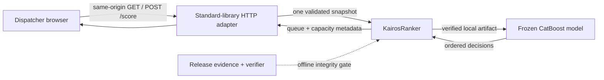

# System architecture

KAIROS is intentionally one small decision path. The competition MVP must prove that one current operational snapshot can become a useful, capacity-bounded human review queue; a service mesh, database, or separate frontend build would add failure modes without strengthening that proof.

## Runtime path

1. The HTTP adapter serves an allowlisted HTML, CSS, and JavaScript product surface.
2. `/score` accepts same-origin JSON up to 8 MiB and rejects unsupported media, malformed JSON, and invalid snapshots before returning a queue.
3. `KairosRanker` verifies the model SHA-256 and loaded 21-feature schema, builds decision-time features, and makes one deterministic scoring call.
4. The review-capacity fraction sets `WINDOW_REVIEW` at `max(1, ceil(fraction × targets))`; it does not change ordering.
5. The browser renders rank, decision, promised window, and approved known context without rendering the raw ordering value or worker identifiers.

## Evidence path

`scripts/verify_ai_release.py`, model/data cards, claims register, and closure artifacts are offline release evidence. They do not execute in the request path and cannot silently tune or replace the production model. `scripts/verify_fullstack_release.py` starts the real adapter and verifies its response against direct frozen-engine output.

## Trust boundaries

- **Browser to adapter:** strict content type, request cap, generic errors, same-origin policy, CSP, no secret.
- **Adapter to ranker:** fail-closed snapshot schema and future/outcome-field rejection.
- **Ranker to model:** pinned local artifact hash, feature order, categorical indices, deterministic tie-breaker.
- **Queue to operator:** decision-support only; every intervention remains human-owned.

This local MVP is not internet-production hardened. It has no authentication, rate limiter, TLS termination, multi-tenant isolation, or validated live-operator integration. Those omissions are explicit scope boundaries, not hidden deployment claims.
